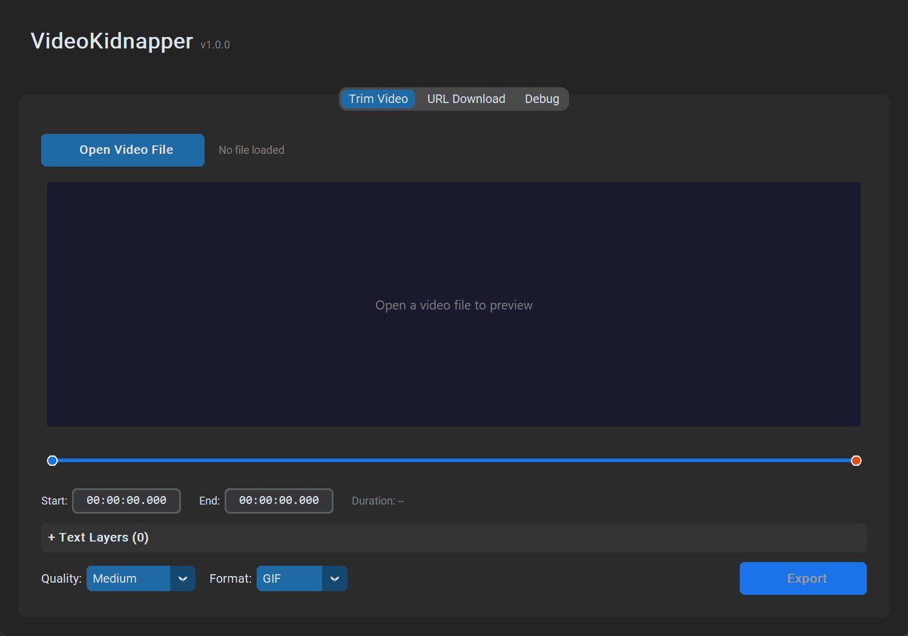
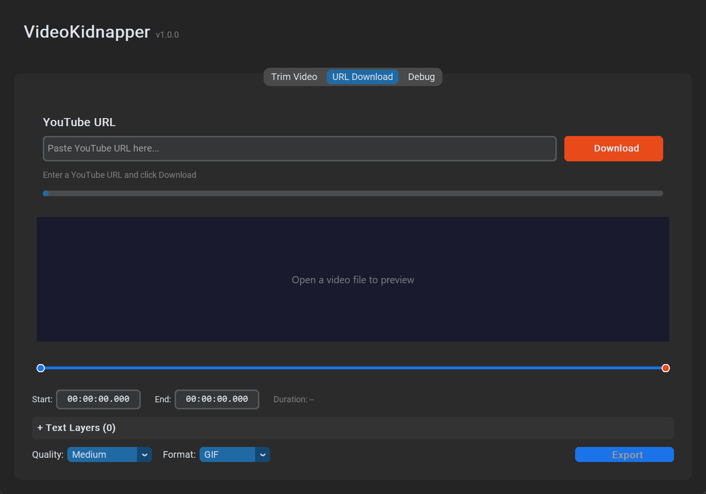
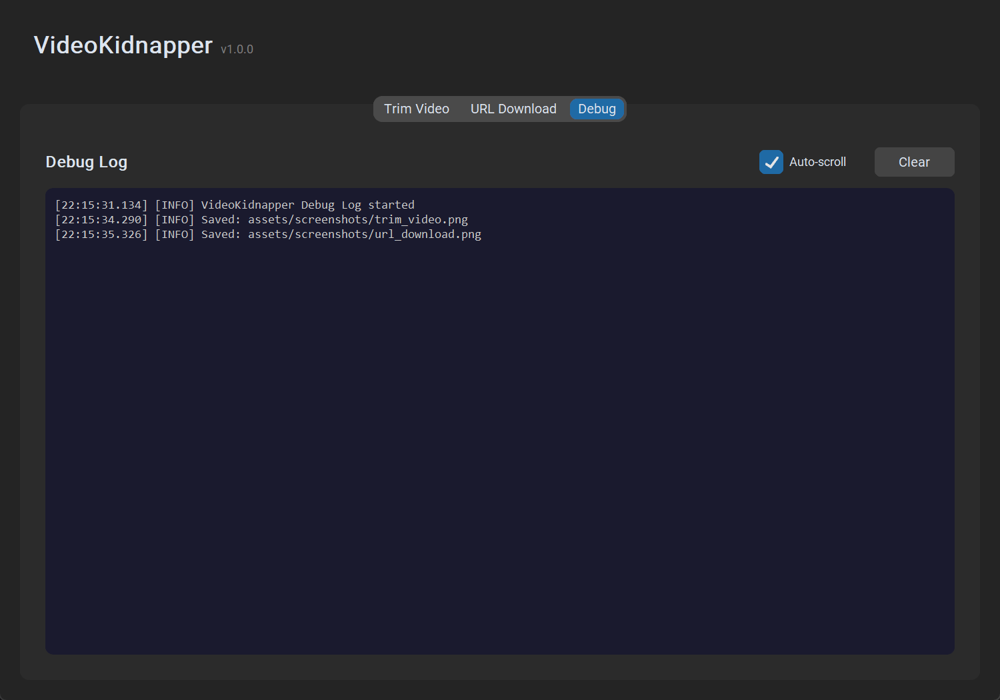

# VideoKidnapper

A modern dark-themed desktop tool for creating GIFs and video clips with text overlays from local video files or YouTube URLs.



---

## Tabs & Features

### Trim Video


- Open any local video file (MP4, MKV, AVI, MOV, WebM, FLV, WMV)
- Frame preview with canvas-based video player
- Dual-handle range slider for precise start/end point selection
- Manual timestamp entry fields (`HH:MM:SS.mmm` format)
- Real-time duration display
- Collapsible **Text Layers** panel for adding text overlays
- Quality preset selector (Low / Medium / High / Ultra)
- Export format toggle (GIF or MP4)
- One-click export to Downloads folder

### URL Download



- Paste any YouTube URL and click **Download**
- Download progress bar with status updates
- Auto-detects FFmpeg for video+audio stream merging
- Once downloaded, full trimming workflow identical to Trim Video tab
- Dual-handle timeline slider with start/end timestamp controls
- Collapsible **Text Layers** panel for overlays
- Quality and format selection with one-click export

### Debug



- Live debug log capturing all stdout/stderr output
- Timestamped entries with `[INFO]` and `[ERROR]` tags
- Monospace console-style display
- Auto-scroll toggle to follow latest output
- Clear button to reset the log
- Useful for diagnosing download errors, FFmpeg issues, or export failures

---

## Text Layers

Both the **Trim Video** and **URL Download** tabs include a collapsible text overlay system:

- Add unlimited text layers, each independently configurable
- **Style presets:** Subtitle (white on semi-transparent black box), Title (large centered), Watermark (small corner), Custom
- Per-layer controls: font family, font size, text color (8 presets), position (7 positions)
- **Per-layer timing slider** controls exactly when each text appears and disappears
- Background box toggle for subtitle-style rendering
- Remove individual layers with the X button

---

## Quality Presets

| Preset | FPS | Max Width | GIF Colors | Video Quality |
|--------|-----|-----------|------------|---------------|
| Low    | 10  | 480px     | 64         | CRF 28        |
| Medium | 15  | 720px     | 128        | CRF 23        |
| High   | 24  | 1080px    | 256        | CRF 18        |
| Ultra  | 30  | Native    | 256        | CRF 15        |

---

## Requirements

- Python 3.9+
- FFmpeg (must be installed separately)

## Installation

1. **Clone the repository:**
   ```bash
   git clone https://github.com/AES256Afro/VideoKidnapper.git
   cd VideoKidnapper
   ```

2. **Install Python dependencies:**
   ```bash
   pip install -r requirements.txt
   ```

3. **Install FFmpeg:**
   - Download from [gyan.dev FFmpeg builds](https://www.gyan.dev/ffmpeg/builds/)
   - Extract the archive
   - Add the `bin/` folder to your system PATH
   - Or place `ffmpeg.exe` and `ffprobe.exe` in `assets/ffmpeg/bin/` within this project

4. **Run VideoKidnapper:**
   ```bash
   python main.py
   ```

## Export Naming

Files are saved as: `VidKid_{mode}_{YYYYMMDD}_{HHMMSS}.{ext}`

Example: `VidKid_trim_20260324_143022.gif`

## Tech Stack

- **CustomTkinter** - Modern dark-themed GUI framework
- **Pillow** - Image processing and display
- **yt-dlp** - YouTube video downloading
- **FFmpeg** - Video/GIF encoding with drawtext overlays

## License

MIT
