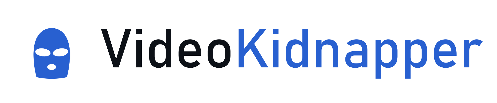
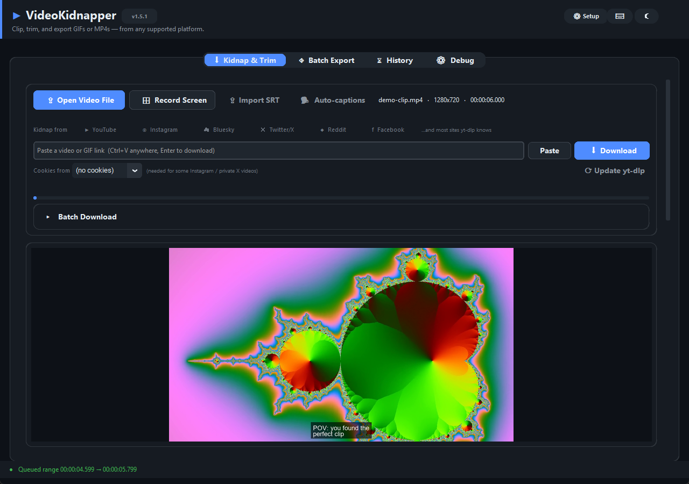
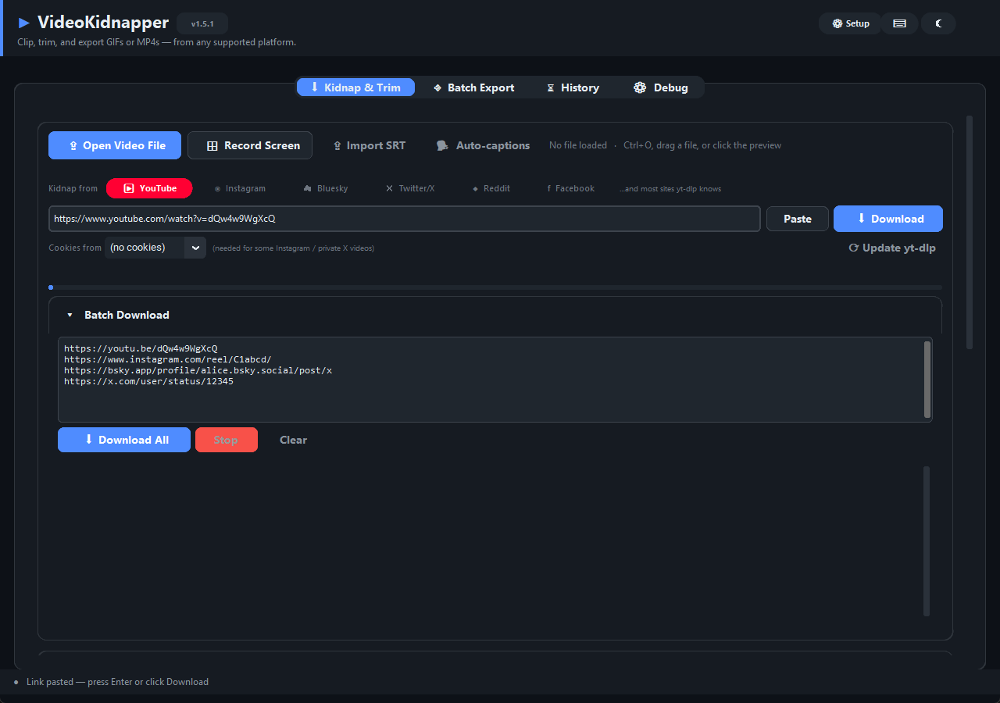

<div align="center">
  <picture>
    <source media="(prefers-color-scheme: dark)" srcset="assets/branding/logo-lockup.png">
    
  </picture>

  <p><strong><a href="https://videokidnapper.com">videokidnapper.com</a></strong> · <a href="https://github.com/AES256Afro/VideoKidnapper/releases/latest">Downloads</a> · <a href="https://videokidnapper.com/screenshots.html">Screenshots</a></p>
</div>

Grab a video from the web, cut the part you want, caption it, and export a clean GIF or MP4 — all on your PC. No watermark, no account, no upload.


---

## What it does

- **Download from the web** — YouTube, Instagram, X, Reddit, Bluesky, Facebook, and 1,000+ other sites yt-dlp supports. Paste a link, `Ctrl+V` from anywhere, or queue a batch. Reads browser cookies for private/age-gated videos.
- **Trim to the exact moment** — frame-accurate timeline with a waveform and thumbnail strip. Queue several cuts from one video; export them separately or stitched with transitions.
- **Captions that look right** — text with outline, shadow, bold/italic, and multiple lines, and the preview matches the exported frame exactly. Auto-caption speech with Whisper, or import an `.srt`/`.vtt`.
- **Overlays** — logos, watermarks, and sticker/GIF overlays dragged anywhere on the frame, with per-layer size, opacity, and timing. Paste an image straight from the clipboard.
- **Export that fits the platform** — tune GIFs (dither, palette, loop) or export hardware-encoded MP4s. Reframe 16:9 → 9:16 for Shorts/Reels/TikTok with a blurred-background fill. Speed, rotate, mute, audio-only, and colour adjustment built in.
- **Record your screen** straight into the editor.
- **Runs fully offline** — no upload, no account, no watermark. Open source, FFmpeg included.

One tab does it all: open a file, record the screen, or paste a link — then trim, caption, and export in the same place. Also has undo/redo, a Batch Export tab, an export History tab, keyboard shortcuts (`Space` play · `J/L` step · `I/O` in-out · `Ctrl+E` export), a CLI mode, and a [plugin API](docs/PLUGINS.md). See [`docs/ROADMAP.md`](docs/ROADMAP.md) for what's next.

---

## Tabs & features

### Kidnap & Trim

One tab for the whole job. Load a video three ways — **Open Video File**, **Record Screen**, or paste a link — then trim, caption, and export in the same place.



With a video loaded: thumbnail strip, waveform, a dual-handle range slider, queued ranges (each exports as its own clip, or they concatenate with transitions when "Concat queued ranges" is on), and a caption showing per-layer controls — multiline text, bold/italic, and Outline/Shadow. The caption renders on the preview exactly as it will export. **Import SRT** and **🗣 Auto-captions** (Whisper) both feed the same text-layer panel.



The **Kidnap from** bar detects the platform as you paste (or `Ctrl+V` a link from anywhere in the app). Supported with brand chips:

| Platform | Host patterns |
|---|---|
| **YouTube** | `youtube.com`, `youtu.be`, `music.youtube.com`, `m.youtube.com` |
| **Instagram** | `instagram.com` |
| **Bluesky** | `bsky.app`, `bsky.social` |
| **Twitter/X** | `twitter.com`, `x.com`, `mobile.twitter.com` |
| **Reddit** | `reddit.com`, `redd.it`, `v.redd.it` (gallery-wrapped + video+audio auto-merged) |
| **Facebook** | `facebook.com`, `fb.watch`, `fb.com`, `m.facebook.com` |

…plus the 1,000+ other sites yt-dlp supports. **Cookies from** reads login cookies from Chrome / Firefox / Edge / Brave / Opera, or a `cookies.txt` export, for private/age-gated videos. (Windows Chrome encrypts its cookie DB — close Chrome fully, use Firefox, or a cookies file; the in-app error explains it.) Downloads retry transient failures with resume, and **⟳ Update yt-dlp** keeps the extractor current. **Batch Download** takes a list of links, grabs them in order, and loads any finished one into the editor with **Use**.

### History


Every successful export is persisted to `~/.videokidnapper_settings.json` — the 25 most recent show here with format, quality preset, timestamp, and file size. **Open** launches the file in the default system player; **Reveal** opens its folder in Explorer / Finder. Missing files (moved or deleted) are dimmed and their buttons disabled.

### Debug


Captures `stdout` + `stderr` with level-colored tags: `INFO` accent-blue, `WARN` amber, `ERROR` red. Uncaught exceptions from Tk callbacks and normal Python code both land here via a global exception hook, so a crash leaves a traceback instead of killing the app. Useful when yt-dlp reports a protected video or ffmpeg rejects a filter chain — the actual error text is here instead of the generic "failed" toast.

### Setup


Opened from the **⚙ Setup** button in the header, or automatically when FFmpeg isn't detected on first run. Each row describes a prerequisite and the feature it unlocks; required items are pre-checked, optional ones wait for opt-in. **Select all missing** toggles every installable row.

- **Install Selected** runs in a background thread: FFmpeg is pulled as a portable Windows build from gyan.dev and extracted into `assets/ffmpeg/bin/` (the app's fallback lookup path). Python packages use `python -m pip install --user` — no admin needed.
- **Open Admin Terminal** launches an elevated shell pre-populated with the right commands for your OS: `winget install Gyan.FFmpeg` on Windows (via PowerShell `Start-Process -Verb RunAs`), `brew install ffmpeg` on macOS (via Terminal + `osascript`), `sudo apt-get install ffmpeg` on Linux. If no terminal is available, commands are copied to the clipboard as a fallback.
- **Relaunch** restarts the current process so newly-installed prerequisites are picked up.

### Share (inside the Export dialog)

After a successful export, the Export dialog reveals a share panel with a caption entry and one button per supported platform. Clicking a button:

1. Copies the exported file to the OS clipboard (Windows: PowerShell `Set-Clipboard -Path`; macOS: `pbcopy`; Linux: `xclip`)
2. Opens the platform's compose / upload page in your browser (pre-filled with your caption on X, Reddit, and Facebook's sharer)
3. Shows a one-line instruction ("Click + Create, then paste the file", etc.)

---

## Text layers

The editor exposes a collapsible **Text Layers** panel with per-layer controls:

- **Style presets** — Subtitle (white-on-black box), Caption (white with black outline, the social-standard look), Title (large centered), Watermark (small corner), Custom
- Per-layer font (all system fonts), size, color (8 presets + **Custom…** color picker), position (7 anchors)
- **Bold / italic** toggles, resolved to real font-variant files (`arialbd.ttf`, `ariali.ttf`, ...) with graceful fallback when a variant is missing
- **Outline** and **Shadow** toggles, compiled to drawtext `borderw` / `shadowx` and mirrored exactly in the preview
- **Multiline captions:** the text box wraps, and embedded newlines export as real line breaks
- Per-layer timing slider — exactly when each text appears and disappears
- Background box toggle
- ▲ / ▼ reorder, ⧉ duplicate, ✕ remove
- **Text fade** (0.25s / 0.5s / 1s, set in Export Options) — symmetric fade-in/fade-out via a drawtext `alpha=` expression
- Live PIL-rendered overlay on the preview canvas — font size, position, and box padding all match ffmpeg's export output

---

## Quality presets

| Preset | FPS | Max Width | GIF Colors | Video CRF |
|---|---|---|---|---|
| Low    | 10 | 480px  | 64  | 28 |
| Medium | 15 | 720px  | 128 | 23 |
| High   | 24 | 1080px | 256 | 18 |
| Ultra  | 30 | Native | 256 | 15 |

When a hardware encoder is available, CRF maps to the right flag per encoder (`-cq` for NVENC, `-global_quality` for QSV, `-q:v` for VideoToolbox).

---

## Keyboard shortcuts

| Key | Action |
|---|---|
| **Space** / **K** | Play / Pause |
| **J** | Seek −1s |
| **L** | Seek +1s |
| **I** | Set in-point at current frame |
| **O** | Set out-point at current frame |
| **Ctrl+Z** | Undo (text-layer edits, crop, trim range, queued ranges) |
| **Ctrl+Y** / **Ctrl+Shift+Z** | Redo |
| **Ctrl+E** | Export |
| **Ctrl+O** | Open video file |
| **Ctrl+V** | Paste — a video/GIF link opens the Kidnap downloader from any tab; a clipboard image becomes an overlay on Trim |

Entry fields swallow shortcuts so typing into them doesn't scrub the video.

---

## Installation

### Option A — Windows (no Python required)

Get it from the **[Microsoft Store](https://apps.microsoft.com/detail/9N4BMTK8Q7KG)** (signed, auto-updates, no security warning), or download **`VideoKidnapper.exe`** / the Setup installer from the [latest release](https://github.com/AES256Afro/VideoKidnapper/releases/latest). Missing prerequisites auto-install on first launch.

### Option B — macOS (no Python required)

Download the `.dmg` for your Mac from the [latest release](https://github.com/AES256Afro/VideoKidnapper/releases/latest) — `…-macos-arm64.dmg` (Apple Silicon) or `…-macos-x86_64.dmg` (Intel) — and drag the app to Applications. FFmpeg is bundled.

> The app isn't code-signed yet, so on first launch **right-click it → Open** (a plain double-click is blocked by Gatekeeper for unsigned apps). After that it opens normally.

### Option C — Linux AppImage (no Python required)

Download **`VideoKidnapper-x86_64.AppImage`** from the [latest release](https://github.com/AES256Afro/VideoKidnapper/releases/latest):

```bash
chmod +x VideoKidnapper-x86_64.AppImage
./VideoKidnapper-x86_64.AppImage
```

FFmpeg is bundled — nothing else to install. Works on any glibc 2.35+ distro: Ubuntu 22.04+, Debian 12+, Fedora 36+, and immutable distros like **Bazzite**, SteamOS 3+, and Silverblue (where the AppImage is the recommended route since you can't layer packages). For an app-menu entry + icon, add it with [Gear Lever](https://flathub.org/apps/it.mijorus.gearlever).

On **Ubuntu / Debian / Mint** you can instead use the APT repository — one-time setup, then updates arrive through normal `apt upgrade`:

```bash
sudo install -d /etc/apt/keyrings
curl -fsSL https://aes256afro.github.io/apt/videokidnapper.asc | sudo tee /etc/apt/keyrings/videokidnapper.asc > /dev/null
echo "deb [signed-by=/etc/apt/keyrings/videokidnapper.asc] https://aes256afro.github.io/apt stable main" | sudo tee /etc/apt/sources.list.d/videokidnapper.list
sudo apt update && sudo apt install videokidnapper
```

(Or grab the `.deb` from the release page and `sudo apt install ./videokidnapper_*.deb` — same package, no repo setup, no auto-updates.)

PyPI also works if you prefer pip:

```bash
sudo apt install python3-pip python3-tk ffmpeg xclip
pip install "videokidnapper[all]"
videokidnapper
```

### Option D — PyPI (recommended if you have Python)

```bash
pip install videokidnapper            # core install
pip install "videokidnapper[dnd]"     # + drag-and-drop support
videokidnapper                        # launches the GUI
videokidnapper --help                 # CLI mode
```

You still need FFmpeg on `PATH` (or use the in-app **⚙ Setup** dialog after first launch to auto-install a portable copy on Windows).

### Option E — Clone and install (contributors / latest `main`)

### 1. Install Python 3.9 – 3.14

### 2. Clone and install

```bash
git clone https://github.com/AES256Afro/VideoKidnapper.git
cd VideoKidnapper
pip install -e .                      # editable install — picks up your edits
# or the old way:
pip install -r requirements.txt
```

### 3. FFmpeg

Three options — the Setup dialog handles all of them:

- **Auto-install (Windows)**: open **⚙ Setup** → check FFmpeg → **Install Selected**. Pulls the gyan.dev essentials build into `assets/ffmpeg/bin/`.
- **Manual portable**: drop `ffmpeg.exe` and `ffprobe.exe` into `assets/ffmpeg/bin/` yourself.
- **System install**: `winget install Gyan.FFmpeg` (Windows) / `brew install ffmpeg` (macOS) / `sudo apt install ffmpeg` (Linux).

### 4. Run

```bash
python main.py           # GUI (works from a clone without installing)
python main.py --help    # CLI help
# or, after `pip install -e .`:
videokidnapper           # GUI
videokidnapper --help    # CLI help
```

---

## CLI mode

```bash
python main.py --url "https://youtu.be/..." --start 10 --end 25 \
               --format GIF --quality High --speed 1.5 --aspect 9:16
```

All flags: `--url`, `--file`, `--start`, `--end`, `--out`, `--format {MP4,GIF}`, `--quality {Low,Medium,High,Ultra}`, `--speed`, `--rotate {0,90,180,270}`, `--mute`, `--audio-only`, `--aspect {Source,1:1,9:16,16:9,4:5,3:4}`, `--hw {auto,off}`.

Passing any flag (or `--help`) skips the GUI and runs headless.

---

## Export naming

Files are saved as `VidKid_{mode}_{YYYYMMDD}_{HHMMSS}.{ext}` in the configured output folder (set via **Export Options → Output folder**).

Example: `VidKid_trim_20260417_221530.mp4`

When "Concat queued ranges" is enabled, the final merged output uses `_concat` in the mode slot and the intermediate per-range files are cleaned up.

---

## Tech stack

- **CustomTkinter** — dark-themed GUI framework
- **Pillow** — frame preview + live text-layer overlay
- **yt-dlp** — multi-platform video downloading
- **FFmpeg** — video/GIF encoding with drawtext overlays
- **mss** — cross-platform screen capture
- **tkinterdnd2** *(optional)* — drag-and-drop on the preview canvas

---

## Tests

```bash
pip install pytest
python -m pytest tests/ -v
```

410+ tests covering URL detection, platform share intents, ffmpeg filter construction (crop clamping, aspect-crop and blur-fill math, fade expressions, GIF palette builders, hardware encoder picking / probing), text styling (outline / shadow / font-variant resolution / multiline), download retry classification and cookie resolution, settings persistence + schema migration, SRT parser, size estimator, LRU cache behavior, and the DnD payload parser.

---

---

## Disclaimer & terms of use

VideoKidnapper is a personal utility for trimming and re-encoding video you have the right to use. By running this software you acknowledge:

- **Platform terms of service.** Downloading from services like YouTube, Instagram, Twitter/X, Reddit, Bluesky, and Facebook may violate their terms of service. You are responsible for ensuring your use complies with each platform's current ToS, your local laws, and applicable copyright law (DMCA, Fair Use, and equivalents in your jurisdiction).
- **Copyright.** Re-hosting, re-sharing, or monetizing content you don't own or have a license to use is your responsibility and not this project's.
- **Cookies.** The "Cookies from browser" option reads authentication cookies from your installed browsers through `yt-dlp`. Never share a cookie file or export — it grants session-level access to your accounts.
- **No warranty.** The software is provided "as is" without warranty of any kind; see the LICENSE file for the full terms.

The project's authors and contributors do not endorse or encourage violation of any platform's terms of service or any applicable law.

---

## License

Licensed under the **Apache License, Version 2.0** — see [LICENSE](LICENSE) for the full text.

> **Note on historic releases.** The `v1.0.0` tag and earlier were published under the GNU General Public License v3.0 and remain available under GPLv3. Apache-2.0 applies to `v1.1.0` and every later commit on `main`.

VideoKidnapper depends on several third-party projects with their own licenses:

| Project | License |
|---|---|
| [CustomTkinter](https://github.com/TomSchimansky/CustomTkinter) | MIT |
| [Pillow](https://github.com/python-pillow/Pillow) | MIT-CMU / HPND |
| [yt-dlp](https://github.com/yt-dlp/yt-dlp) | Unlicense |
| [mss](https://github.com/BoboTiG/python-mss) | MIT |
| [tkinterdnd2](https://github.com/pmgagne/tkinterdnd2) | BSD-3-Clause (optional) |
| [FFmpeg](https://ffmpeg.org/) | LGPLv2.1+ / GPLv2+ (build-dependent; `essentials` builds are GPL) |

If you bundle FFmpeg with a redistribution of VideoKidnapper, note that the `essentials` and `full` gyan.dev builds ship under GPL — complying with GPL requires offering source on request. Alternatively, use an `LGPL` FFmpeg build for LGPL-only redistribution.
