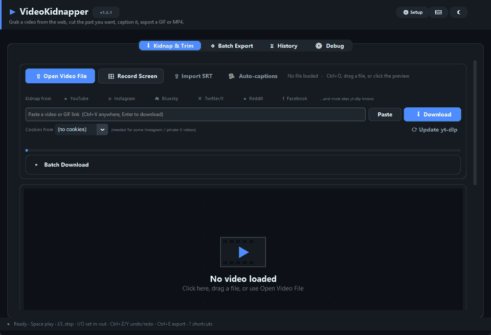
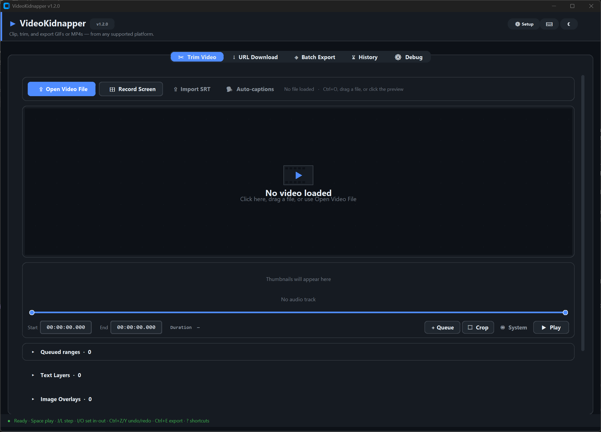
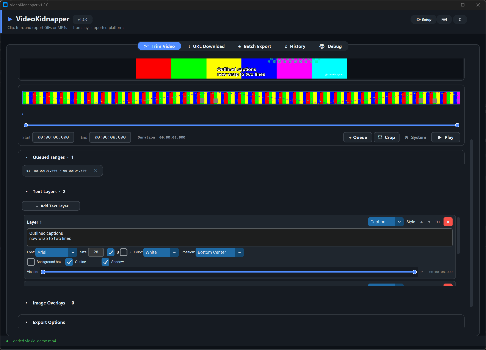
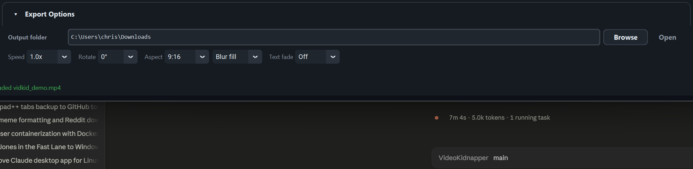
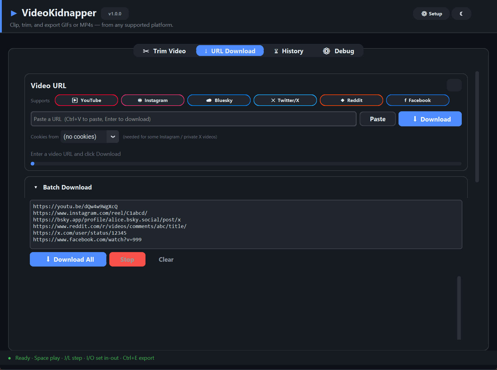
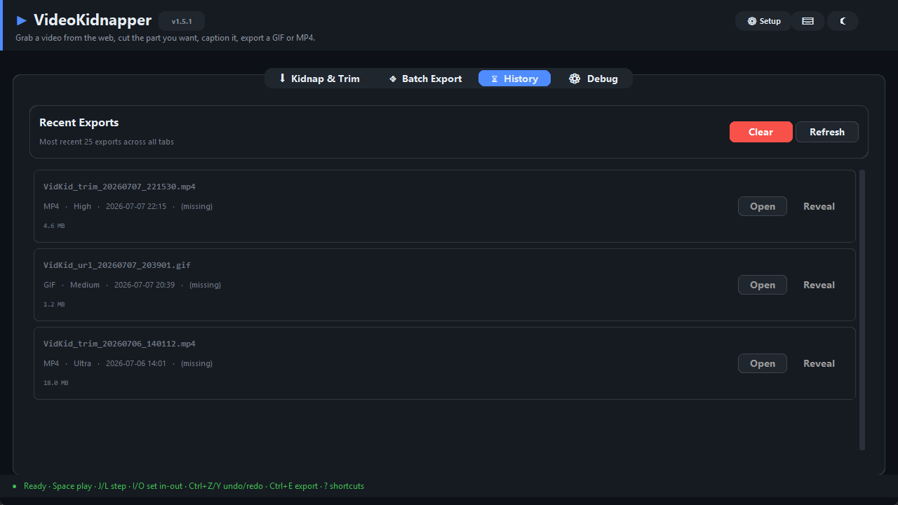
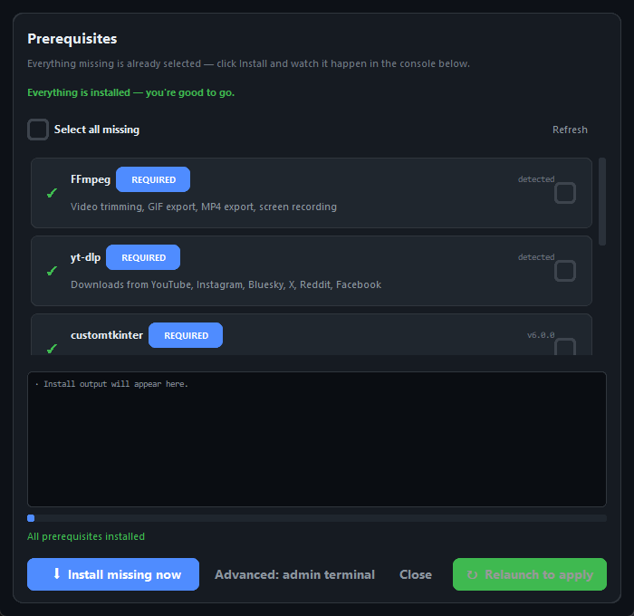

<div align="center">
  

# VideoKidnapper

**[videokidnapper.com](https://videokidnapper.com)** · [Downloads](https://github.com/AES256Afro/VideoKidnapper/releases/latest) · [Screenshots](https://videokidnapper.com/screenshots.html)

</div>

A dark-themed desktop tool for trimming videos, downloading clips from the open web, and exporting polished GIFs or MP4s with text overlays — from any supported platform.



---

## Highlights

- **Multi-platform downloads** — YouTube, Instagram, Bluesky, Twitter/X, Reddit, Facebook
- **Batch URL queue** — paste many links, download sequentially, pick one to edit
- **Resilient downloads:** transient network failures retry automatically and resume the partial file, and a one-click **⟳ Update yt-dlp** button keeps the extractor current
- **Pixel-accurate text overlays** — preview matches export (fontsize, position, box padding all match ffmpeg's output), with per-layer **outline, shadow, bold / italic, and multiline captions**
- **Image / logo overlay track** — drop PNGs / JPGs as overlays with per-layer position, scale, opacity, and timing (watermarks, reaction stickers, brand bugs)
- **Multi-range trimming** — queue N clips from one source, export individually or concatenate into one file
- **Undo / redo** — Ctrl+Z / Ctrl+Y across text-layer edits, crop, trim range, and queued ranges (50-step history)
- **Thumbnail strip** above the timeline — click any thumb to seek; the selected range is outlined in accent
- **Snap-to-guides** when dragging text — horizontal / vertical center, padded edges, and peer-layer edges snap with dashed guide lines
- **SRT import** — drop an SRT/VTT file to auto-populate time-synced text layers
- **Whisper auto-captions** — one click transcribes the current trim range and imports the captions as text layers (requires optional [`faster-whisper`](https://github.com/guillaumekln/faster-whisper))
- **Crop by click-drag** on the preview canvas, or pick an aspect-ratio preset (1:1, 9:16, 16:9, 4:5, 3:4)
- **Export options** — speed (0.25×–4×), rotate, mute, audio-only MP3, text fade in/out, color grade sliders
- **GIF tuning:** dither algorithm (Bayer / Floyd-Steinberg / Sierra / None), palette stats mode (Full frame / Motion), and loop count (Forever / Once / 2-5×)
- **Blurred-background aspect fill:** convert 16:9 to 9:16 (or any aspect preset) with the Shorts / Reels fill look instead of cropping or black bars
- **Hardware encoding** — auto-probes NVENC / QuickSync / VideoToolbox / AMF and falls back cleanly to libx264
- **Screen recording** — capture your monitor and drop the result straight into the trim workflow
- **Share to platform** — one click copies the exported file to clipboard and opens the compose page on YouTube, Instagram, Bluesky, X, Reddit, or Facebook
- **Drag-and-drop** video files onto the preview (requires [`tkinterdnd2`](https://pypi.org/project/tkinterdnd2/))
- **Real-time in-app playback with audio** — `imageio-ffmpeg` + `sounddevice` decode video frames and PCM audio into an audio-mastered playback loop. Falls back to an 8-fps frame-scrub preview when the optional deps aren't installed.
- **Play in System Player** — still available as a fallback route, with full OS-player features
- **Live waveform** above the timeline
- **History tab** — recent exports with Open / Reveal actions
- **Keyboard shortcuts** — Space play · J/L ±1s · I/O set in-out · Ctrl+E export · Ctrl+O open file
- **Setup dialog** auto-installs missing prerequisites (FFmpeg portable + pip packages) or opens an elevated terminal with the right commands
- **CLI mode** — `python main.py --url ... --start 10 --end 25 --format GIF`
- **Plugin system** — third-party packages can add tabs and lifecycle hooks via the `videokidnapper.plugins` entry-point group; see [`docs/PLUGINS.md`](docs/PLUGINS.md) for the API
- **Light / dark themes**
- **Roadmap:** see [`docs/ROADMAP.md`](docs/ROADMAP.md) for what's planned next (audio track, boomerang GIFs, size-targeted export, silence auto-cut, and more)

---

## Tabs & features

### Trim Video



The empty state tells you every way to load a file: click the preview, drag one in, or use **Open Video File**. The **Record Screen** button captures your primary monitor for N seconds and drops the recording straight into the workflow. **Import SRT** reads an `.srt`/`.vtt` subtitle file and creates one time-synced text layer per caption. The timeline shows the waveform, a dual-handle range slider, and the `+ Queue / Crop / System / Play` controls. The status bar at the bottom lists the active keyboard shortcuts.



With a video loaded: thumbnail strip, waveform, a queued range (each queued range exports as its own clip, or they concatenate when "Concat queued ranges" is on), and a Caption-style text layer showing the per-layer controls: multiline text box, bold / italic toggles, and the Outline / Shadow checkboxes. The outlined two-line caption renders on the preview exactly as it will export. Timestamp entries accept `HH:MM:SS.mmm` input.



The expanded **Export Options** panel: speed / rotate / aspect with the **Fill** mode dropdown (Crop or Blur fill), text fade, color grade sliders, concat transitions, and the GIF row (dither algorithm, palette stats mode, loop count).

### URL Download


Paste a URL and the matching platform chip lights up with its brand color. Supported platforms:

| Platform | Host patterns |
|---|---|
| **YouTube** | `youtube.com`, `youtu.be`, `music.youtube.com`, `m.youtube.com` |
| **Instagram** | `instagram.com` |
| **Bluesky** | `bsky.app`, `bsky.social` |
| **Twitter/X** | `twitter.com`, `x.com`, `mobile.twitter.com` |
| **Reddit** | `reddit.com`, `redd.it`, `v.redd.it` (gallery-wrapped + video+audio auto-merged) |
| **Facebook** | `facebook.com`, `fb.watch`, `fb.com`, `m.facebook.com` |

**Cookies from** reads login cookies from Chrome / Firefox / Edge / Brave / Opera, or from a `cookies.txt` export via the **Cookies file…** picker, for Instagram and private X videos that require authentication. Note that current Windows Chrome locks and encrypts its cookie database (App-Bound Encryption), so direct Chrome reads often fail; close Chrome fully, switch to Firefox, or use a cookies file (the in-app error message walks you through exactly that). yt-dlp is invoked with platform-aware format selectors (progressive MP4 for X/Instagram, HLS-aware for Bluesky, video+audio muxing for Reddit), and downloads retry transient network failures with resume.



**Batch Download** takes a list of URLs (one per line), downloads them sequentially, and shows per-row status with a **Use** button that loads the finished video into the trim workflow. Stop at any time.

### History



Every successful export is persisted to `~/.videokidnapper_settings.json` — the 25 most recent show here with format, quality preset, timestamp, and file size. **Open** launches the file in the default system player; **Reveal** opens its folder in Explorer / Finder. Missing files (moved or deleted) are dimmed and their buttons disabled.

### Debug


Captures `stdout` + `stderr` with level-colored tags: `INFO` accent-blue, `WARN` amber, `ERROR` red. Uncaught exceptions from Tk callbacks and normal Python code both land here via a global exception hook, so a crash leaves a traceback instead of killing the app. Useful when yt-dlp reports a protected video or ffmpeg rejects a filter chain — the actual error text is here instead of the generic "failed" toast.

### Setup



Opened from the **⚙ Setup** button in the header, or automatically when FFmpeg isn't detected on first run. Each row describes a prerequisite and the feature it unlocks; required items are pre-checked, optional ones wait for opt-in. **Select all missing** toggles every installable row.

- **Install Selected** runs in a background thread: FFmpeg is pulled as a portable Windows build from gyan.dev and extracted into `assets/ffmpeg/bin/` (the app's fallback lookup path). Python packages use `python -m pip install --user` — no admin needed.
- **Open Admin Terminal** launches an elevated shell pre-populated with the right commands for your OS: `winget install Gyan.FFmpeg` on Windows (via PowerShell `Start-Process -Verb RunAs`), `brew install ffmpeg` on macOS (via Terminal + `osascript`), `sudo apt-get install ffmpeg` on Linux. If no terminal is available, commands are copied to the clipboard as a fallback.
- **Relaunch** restarts the current process so newly-installed prerequisites are picked up.

### Share (inside the Export dialog)

After a successful export, the Export dialog reveals a share panel with a caption entry and one button per supported platform. Clicking a button:

1. Copies the exported file to the OS clipboard (Windows: PowerShell `Set-Clipboard -Path`; macOS: `pbcopy`; Linux: `xclip`)
2. Opens the platform's compose / upload page in your browser (pre-filled with your caption on X, Reddit, and Facebook's sharer)
3. Shows a one-line instruction ("Click + Create, then paste the file", etc.)

---

## Text layers

Both tabs expose a collapsible **Text Layers** panel with per-layer controls:

- **Style presets** — Subtitle (white-on-black box), Caption (white with black outline, the social-standard look), Title (large centered), Watermark (small corner), Custom
- Per-layer font (all system fonts), size, color (8 presets + **Custom…** color picker), position (7 anchors)
- **Bold / italic** toggles, resolved to real font-variant files (`arialbd.ttf`, `ariali.ttf`, ...) with graceful fallback when a variant is missing
- **Outline** and **Shadow** toggles, compiled to drawtext `borderw` / `shadowx` and mirrored exactly in the preview
- **Multiline captions:** the text box wraps, and embedded newlines export as real line breaks
- Per-layer timing slider — exactly when each text appears and disappears
- Background box toggle
- ▲ / ▼ reorder, ⧉ duplicate, ✕ remove
- **Text fade** (0.25s / 0.5s / 1s, set in Export Options) — symmetric fade-in/fade-out via a drawtext `alpha=` expression
- Live PIL-rendered overlay on the preview canvas — font size, position, and box padding all match ffmpeg's export output

---

## Quality presets

| Preset | FPS | Max Width | GIF Colors | Video CRF |
|---|---|---|---|---|
| Low    | 10 | 480px  | 64  | 28 |
| Medium | 15 | 720px  | 128 | 23 |
| High   | 24 | 1080px | 256 | 18 |
| Ultra  | 30 | Native | 256 | 15 |

When a hardware encoder is available, CRF maps to the right flag per encoder (`-cq` for NVENC, `-global_quality` for QSV, `-q:v` for VideoToolbox).

---

## Keyboard shortcuts

| Key | Action |
|---|---|
| **Space** / **K** | Play / Pause |
| **J** | Seek −1s |
| **L** | Seek +1s |
| **I** | Set in-point at current frame |
| **O** | Set out-point at current frame |
| **Ctrl+Z** | Undo (text-layer edits, crop, trim range, queued ranges) |
| **Ctrl+Y** / **Ctrl+Shift+Z** | Redo |
| **Ctrl+E** | Export |
| **Ctrl+O** | Open video file |
| **Ctrl+V** | Paste URL (URL tab) |

Entry fields swallow shortcuts so typing into them doesn't scrub the video.

---

## Installation

### Option A — Windows `.exe` (no Python required)

Download **`VideoKidnapper.exe`** from the [latest release](https://github.com/AES256Afro/VideoKidnapper/releases/latest), double-click to run. FFmpeg is still an external prereq — the app's **⚙ Setup** dialog will auto-install a portable copy on first launch if one isn't on PATH.

### Option B — Linux AppImage (no Python required)

Download **`VideoKidnapper-x86_64.AppImage`** from the [latest release](https://github.com/AES256Afro/VideoKidnapper/releases/latest):

```bash
chmod +x VideoKidnapper-x86_64.AppImage
./VideoKidnapper-x86_64.AppImage
```

FFmpeg is bundled — nothing else to install. Works on any glibc 2.35+ distro: Ubuntu 22.04+, Debian 12+, Fedora 36+, and immutable distros like **Bazzite**, SteamOS 3+, and Silverblue (where the AppImage is the recommended route since you can't layer packages). For an app-menu entry + icon, add it with [Gear Lever](https://flathub.org/apps/it.mijorus.gearlever).

On **Ubuntu / Debian / Mint** you can instead use the APT repository — one-time setup, then updates arrive through normal `apt upgrade`:

```bash
sudo install -d /etc/apt/keyrings
curl -fsSL https://aes256afro.github.io/apt/videokidnapper.asc | sudo tee /etc/apt/keyrings/videokidnapper.asc > /dev/null
echo "deb [signed-by=/etc/apt/keyrings/videokidnapper.asc] https://aes256afro.github.io/apt stable main" | sudo tee /etc/apt/sources.list.d/videokidnapper.list
sudo apt update && sudo apt install videokidnapper
```

(Or grab the `.deb` from the release page and `sudo apt install ./videokidnapper_*.deb` — same package, no repo setup, no auto-updates.)

PyPI also works if you prefer pip:

```bash
sudo apt install python3-pip python3-tk ffmpeg xclip
pip install "videokidnapper[all]"
videokidnapper
```

### Option C — PyPI (recommended if you have Python)

```bash
pip install videokidnapper            # core install
pip install "videokidnapper[dnd]"     # + drag-and-drop support
videokidnapper                        # launches the GUI
videokidnapper --help                 # CLI mode
```

You still need FFmpeg on `PATH` (or use the in-app **⚙ Setup** dialog after first launch to auto-install a portable copy on Windows).

### Option D — Clone and install (contributors / latest `main`)

### 1. Install Python 3.9 – 3.14

### 2. Clone and install

```bash
git clone https://github.com/AES256Afro/VideoKidnapper.git
cd VideoKidnapper
pip install -e .                      # editable install — picks up your edits
# or the old way:
pip install -r requirements.txt
```

### 3. FFmpeg

Three options — the Setup dialog handles all of them:

- **Auto-install (Windows)**: open **⚙ Setup** → check FFmpeg → **Install Selected**. Pulls the gyan.dev essentials build into `assets/ffmpeg/bin/`.
- **Manual portable**: drop `ffmpeg.exe` and `ffprobe.exe` into `assets/ffmpeg/bin/` yourself.
- **System install**: `winget install Gyan.FFmpeg` (Windows) / `brew install ffmpeg` (macOS) / `sudo apt install ffmpeg` (Linux).

### 4. Run

```bash
python main.py           # GUI (works from a clone without installing)
python main.py --help    # CLI help
# or, after `pip install -e .`:
videokidnapper           # GUI
videokidnapper --help    # CLI help
```

---

## CLI mode

```bash
python main.py --url "https://youtu.be/..." --start 10 --end 25 \
               --format GIF --quality High --speed 1.5 --aspect 9:16
```

All flags: `--url`, `--file`, `--start`, `--end`, `--out`, `--format {MP4,GIF}`, `--quality {Low,Medium,High,Ultra}`, `--speed`, `--rotate {0,90,180,270}`, `--mute`, `--audio-only`, `--aspect {Source,1:1,9:16,16:9,4:5,3:4}`, `--hw {auto,off}`.

Passing any flag (or `--help`) skips the GUI and runs headless.

---

## Export naming

Files are saved as `VidKid_{mode}_{YYYYMMDD}_{HHMMSS}.{ext}` in the configured output folder (set via **Export Options → Output folder**).

Example: `VidKid_trim_20260417_221530.mp4`

When "Concat queued ranges" is enabled, the final merged output uses `_concat` in the mode slot and the intermediate per-range files are cleaned up.

---

## Tech stack

- **CustomTkinter** — dark-themed GUI framework
- **Pillow** — frame preview + live text-layer overlay
- **yt-dlp** — multi-platform video downloading
- **FFmpeg** — video/GIF encoding with drawtext overlays
- **mss** — cross-platform screen capture
- **tkinterdnd2** *(optional)* — drag-and-drop on the preview canvas

---

## Tests

```bash
pip install pytest
python -m pytest tests/ -v
```

410+ tests covering URL detection, platform share intents, ffmpeg filter construction (crop clamping, aspect-crop and blur-fill math, fade expressions, GIF palette builders, hardware encoder picking / probing), text styling (outline / shadow / font-variant resolution / multiline), download retry classification and cookie resolution, settings persistence + schema migration, SRT parser, size estimator, LRU cache behavior, and the DnD payload parser.

---

---

## Disclaimer & terms of use

VideoKidnapper is a personal utility for trimming and re-encoding video you have the right to use. By running this software you acknowledge:

- **Platform terms of service.** Downloading from services like YouTube, Instagram, Twitter/X, Reddit, Bluesky, and Facebook may violate their terms of service. You are responsible for ensuring your use complies with each platform's current ToS, your local laws, and applicable copyright law (DMCA, Fair Use, and equivalents in your jurisdiction).
- **Copyright.** Re-hosting, re-sharing, or monetizing content you don't own or have a license to use is your responsibility and not this project's.
- **Cookies.** The "Cookies from browser" option reads authentication cookies from your installed browsers through `yt-dlp`. Never share a cookie file or export — it grants session-level access to your accounts.
- **No warranty.** The software is provided "as is" without warranty of any kind; see the LICENSE file for the full terms.

The project's authors and contributors do not endorse or encourage violation of any platform's terms of service or any applicable law.

---

## License

Licensed under the **Apache License, Version 2.0** — see [LICENSE](LICENSE) for the full text.

> **Note on historic releases.** The `v1.0.0` tag and earlier were published under the GNU General Public License v3.0 and remain available under GPLv3. Apache-2.0 applies to `v1.1.0` and every later commit on `main`.

VideoKidnapper depends on several third-party projects with their own licenses:

| Project | License |
|---|---|
| [CustomTkinter](https://github.com/TomSchimansky/CustomTkinter) | MIT |
| [Pillow](https://github.com/python-pillow/Pillow) | MIT-CMU / HPND |
| [yt-dlp](https://github.com/yt-dlp/yt-dlp) | Unlicense |
| [mss](https://github.com/BoboTiG/python-mss) | MIT |
| [tkinterdnd2](https://github.com/pmgagne/tkinterdnd2) | BSD-3-Clause (optional) |
| [FFmpeg](https://ffmpeg.org/) | LGPLv2.1+ / GPLv2+ (build-dependent; `essentials` builds are GPL) |

If you bundle FFmpeg with a redistribution of VideoKidnapper, note that the `essentials` and `full` gyan.dev builds ship under GPL — complying with GPL requires offering source on request. Alternatively, use an `LGPL` FFmpeg build for LGPL-only redistribution.
