<div align="center">
  <picture>
    <source media="(prefers-color-scheme: dark)" srcset="assets/branding/logo-lockup.png">
    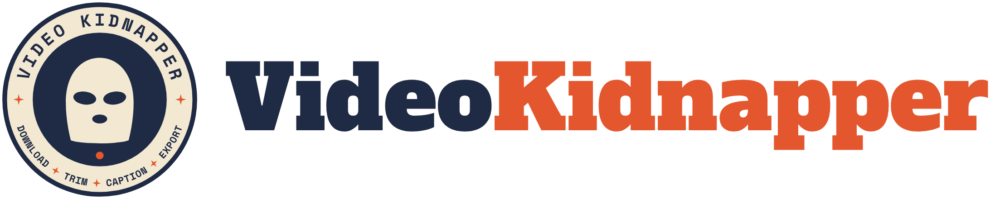
  </picture>

  <p><strong><a href="https://videokidnapper.com">videokidnapper.com</a></strong> · <a href="https://github.com/AES256Afro/VideoKidnapper/releases/latest">Downloads</a> · <a href="https://videokidnapper.com/screenshots.html">Screenshots</a></p>
</div>

Grab a video from the web, cut the part you want, caption it, and export a clean GIF or MP4. Everything runs on your PC. No watermark, no account, no upload.

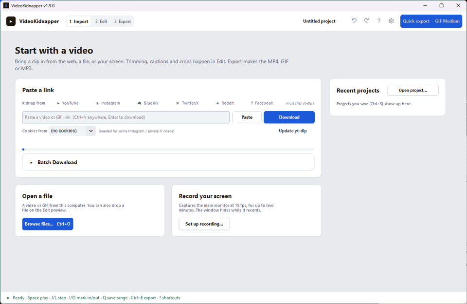

---

## What it does

- **Download from the web.** YouTube, Instagram, X, Reddit, Bluesky, Facebook, and 1,000+ other sites yt-dlp supports. Paste a link, press `Ctrl+V` from anywhere, or queue a batch. Reads browser cookies for private and age-gated videos.
- **Trim to the exact moment.** Frame-accurate timeline with a waveform and thumbnail strip. Queue several cuts from one video, then export them separately or stitched with transitions.
- **Captions that look right.** Text with outline, shadow, bold, italic, and multiple lines, and the preview matches the exported frame exactly. Auto-caption speech with Whisper, or import an `.srt` or `.vtt`.
- **Captions that follow the action.** Pin a caption to a moving subject and it tracks them across the frame, the way the "click for more" memes do. Drag to set the path by hand, or choose **Follow an object from here** and let it follow the subject for you. Preview and export stay in sync.
- **Overlays.** Logos, watermarks, and sticker or GIF overlays dragged anywhere on the frame, each with its own size, opacity, and timing. Paste an image straight from the clipboard.
- **Export for the platform.** Tune GIFs (dither, palette, loop) or export hardware-encoded MP4s. Reframe 16:9 to 9:16 for Shorts, Reels, and TikTok with a blurred-background fill. Speed, rotate, mute, audio-only, and colour adjustment are built in.
- **Record your screen** straight into the editor.
- **Save real projects.** `.vidkid` project files preserve the source link, trim ranges, crop, captions, overlays, and export choices. Autosave recovery protects work after an interrupted session, and recent projects stay one click away.
- **Updates that fit the install.** Store installs update through the Microsoft Store; Setup, winget and portable installs open the GitHub release; pip, APT, AppImage, macOS and source installs each get the route that fits them.
- **Runs fully offline.** No upload, no account, no watermark. Open source, FFmpeg included.

The app is three steps across the top of the window: **Import** brings a clip in (a file, a screen recording, or a link), **Edit** is where you trim, caption, crop and color it, and **Export** makes the MP4, GIF or MP3. Edit fits on one screen with no scrolling. VideoKidnapper also has undo and redo, project save and recovery, batch export, an export history, keyboard shortcuts (`Ctrl+S` project, `Space` play, `J`/`L` step, `I`/`O` in-out, `Q` save range, `Ctrl+E` export; `⌘` on a Mac), five themes, a CLI mode, and a [plugin API](docs/PLUGINS.md). See [`docs/ROADMAP.md`](docs/ROADMAP.md) for what is next.

---

## Workspaces & features

### Edit

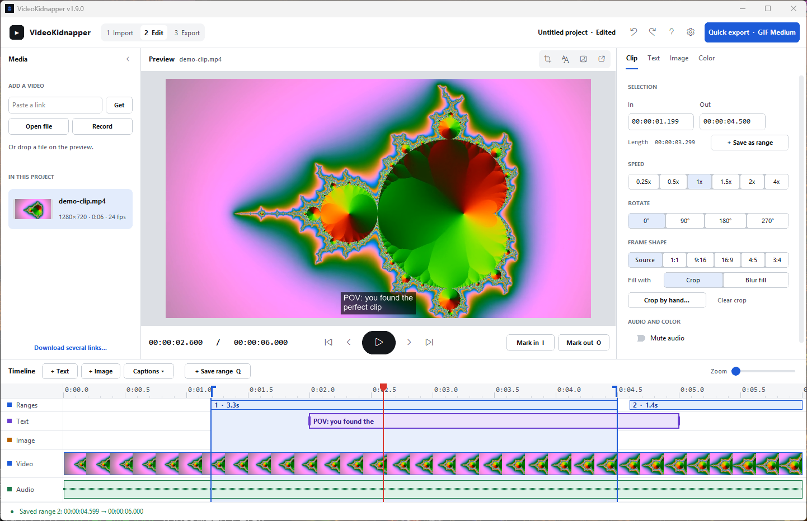

The media panel sits on the left (collapse it to a thin rail for a bigger preview), the preview with play controls in the middle, the **Inspector** on the right, and a **timeline** underneath. The timeline stacks saved ranges, caption clips, image-overlay clips, a filmstrip, and the waveform under one playhead: click to seek, drag the blue in/out edges to pick the part, drag a caption or overlay to move it, drag its edge to retime it, and `Ctrl`+wheel to zoom. Press `Q` to save the selection as a range; each range exports as its own clip, or they join into one video with a cut, crossfade, or fade.

The Inspector edits one thing at a time. **Clip** has the in/out times, speed, rotate, frame shape (center-crop or blurred fill), hand crop, and mute. **Text** edits the selected caption: multiline text, style preset, font, size, bold, italic, color, outline, shadow, box, position, timing, and fade. **Image** edits the selected overlay. **Color** has brightness, contrast, saturation, and gamma, and the preview shows the change so what you see is what you export. Captions render on the preview exactly as they will export. **Captions ▸ Import SRT or VTT** and **Captions from speech** (Whisper) both add caption clips to the timeline.

Turn on **Record a motion path** and a caption follows a moving subject across the frame, like the "click for more" memes. Drag the caption at a few points in the clip to set its path by hand, or drop the caption on your subject and choose **Follow an object from here** to have it follow them automatically (OpenCV object tracking, bundled in the Store, Windows, macOS, and Linux AppImage builds). The same interpolation drives the preview and the export, so what you see is what renders.

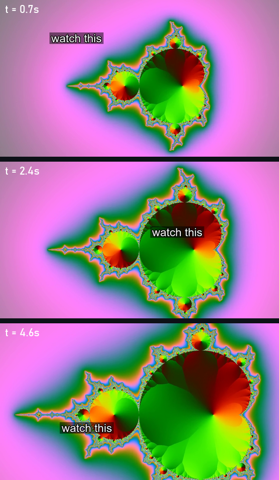

### Import

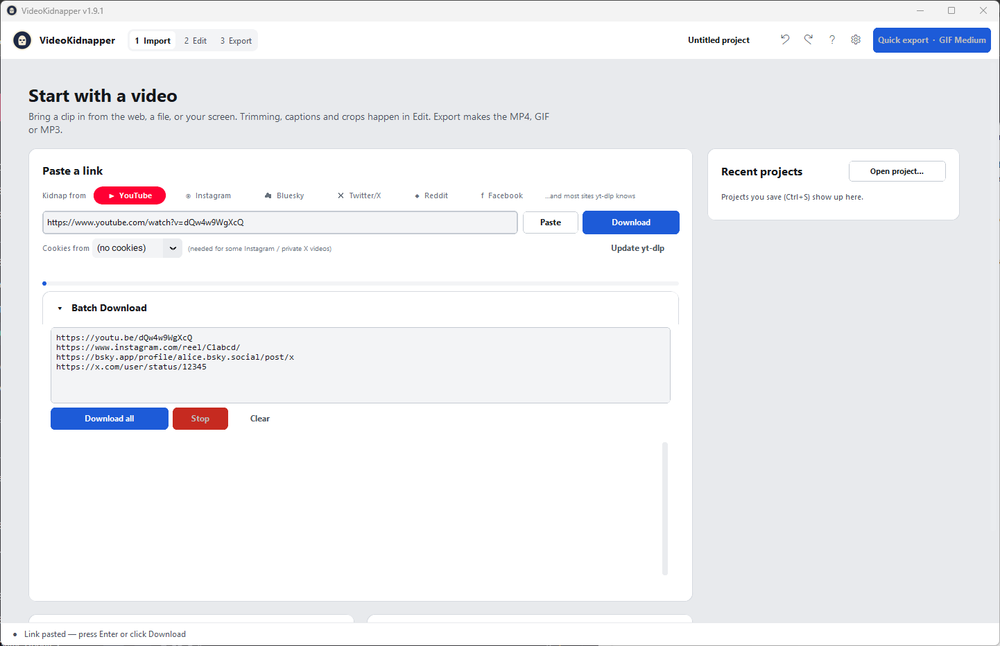

Import is where a clip comes in: paste a link, open a file, record the screen, or reopen a recent project. Whatever loads lands in Edit. The **Kidnap from** bar detects the platform as you paste (or press `Ctrl+V` to drop a link in from anywhere in the app). Supported with brand chips:

| Platform | Host patterns |
|---|---|
| **YouTube** | `youtube.com`, `youtu.be`, `music.youtube.com`, `m.youtube.com` |
| **Instagram** | `instagram.com` |
| **Bluesky** | `bsky.app`, `bsky.social` |
| **Twitter/X** | `twitter.com`, `x.com`, `mobile.twitter.com` |
| **Reddit** | `reddit.com`, `redd.it`, `v.redd.it` (gallery-wrapped + video+audio auto-merged) |
| **Facebook** | `facebook.com`, `fb.watch`, `fb.com`, `m.facebook.com` |

…plus the 1,000+ other sites yt-dlp supports. **Cookies from** reads login cookies from Chrome / Firefox / Edge / Brave / Opera, or a `cookies.txt` export, for private/age-gated videos. (Windows Chrome encrypts its cookie DB, so close Chrome fully, use Firefox, or a cookies file; the in-app error explains it.) Downloads retry transient failures with resume, and **Update compatibility** keeps the extractor current. **Batch Download** takes a list of links, grabs them in order, and loads any finished one into the editor with **Use**.

### Export

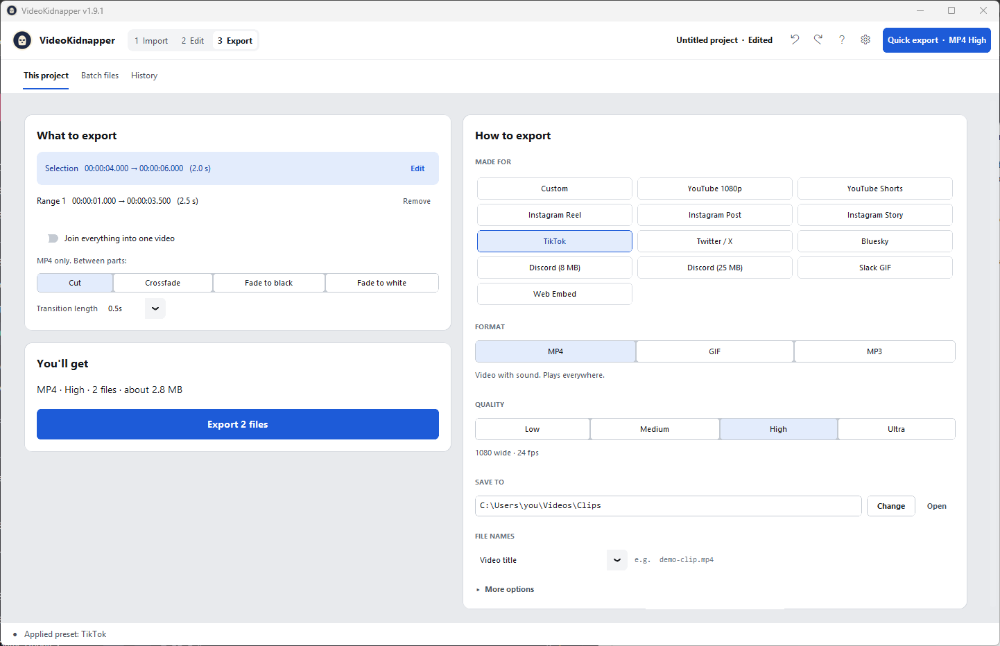

**This project** puts every export decision on one page: what to export (the selection plus saved ranges, optionally joined), what it's made for (YouTube, Shorts, Reels, TikTok, X, Bluesky, Discord size limits, Slack GIF, and more), format, quality, and where it's saved. **Quick export** in the header (`Ctrl+E`) exports with these settings from anywhere.

**Batch files** exports whole local files with one set of settings: a queue where each row can target a different platform, with quality, MP4 or MP3, and the save folder on the side. Speed, rotate, frame shape, and color come from Edit, so there's one place to change them.

### History

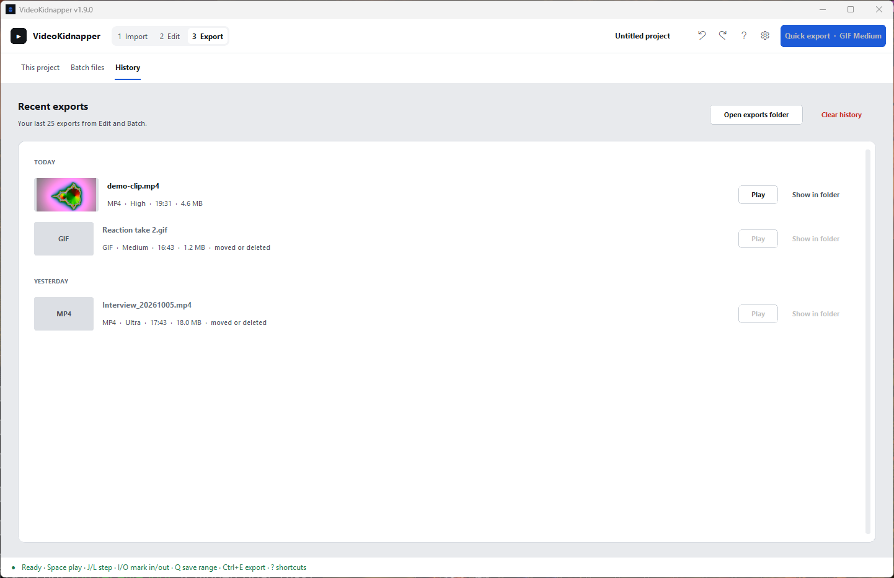

Every successful export, from Edit or Batch, is persisted to `~/.videokidnapper_settings.json`. The 25 most recent show under **Export ▸ History**, grouped by day, with a thumbnail, format, quality preset, time, and file size. **Play** opens the file in the default player; **Show in folder** opens its folder in Explorer / Finder. Missing files (moved or deleted) are dimmed and their buttons disabled.

### Projects and recovery

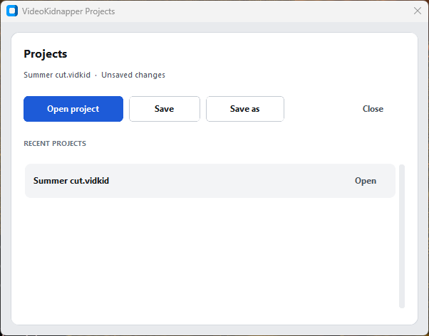

Press `Ctrl+S` to save a `.vidkid` project, `Ctrl+Shift+S` to save a copy, or `Ctrl+Shift+O` to open one. Project files keep the source video reference, trim and queued ranges, crop, text and image layers, plus export choices. Relative media paths travel with a project folder when possible. Unsaved edits are written atomically to a recovery file, and the next launch offers to recover it after an interrupted session.

### App updates

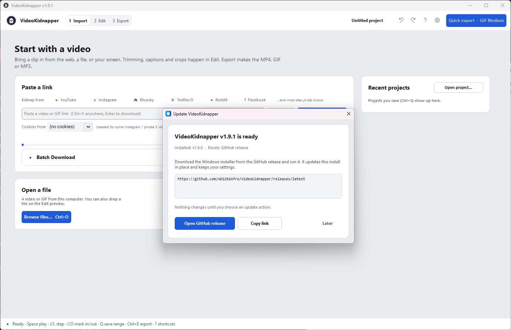

When a release is available, an **Update** chip appears in the header (or use **Check for updates** in the settings menu). Microsoft Store installs update through the Store. Setup and winget installs open the GitHub release, whose Setup installer updates them in place and keeps your settings. pip and APT installs use their package manager. Portable, AppImage, macOS, and source installs open the matching release instead of replacing a running executable in place.

### Debug log

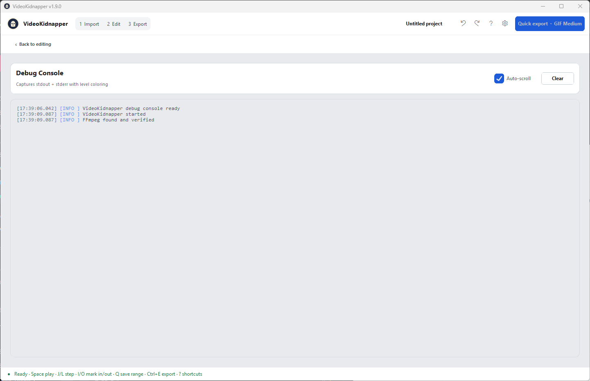

Open it from **Debug log** in the settings (gear) menu.

Captures `stdout` + `stderr` with level-colored tags: `INFO` accent-blue, `WARN` amber, `ERROR` red. Uncaught exceptions from Tk callbacks and normal Python code both land here via a global exception hook, so a crash leaves a traceback instead of killing the app. Useful when yt-dlp reports a protected video or ffmpeg rejects a filter chain — the actual error text is here instead of the generic "failed" toast.

### Setup

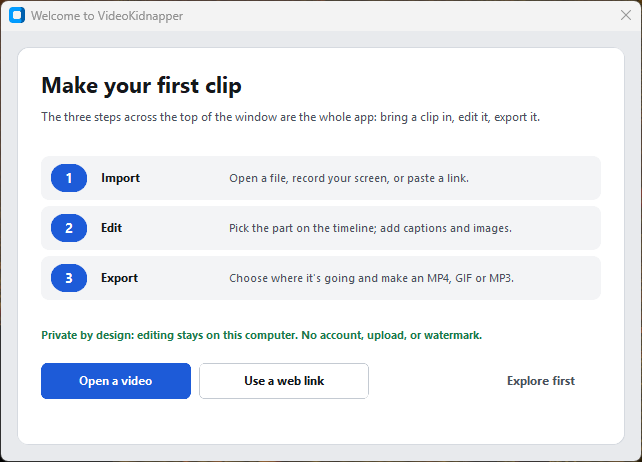

New installs start with a short three-step welcome and direct actions for opening a local video or using a web link. Editing stays on the computer, with no account or upload required.

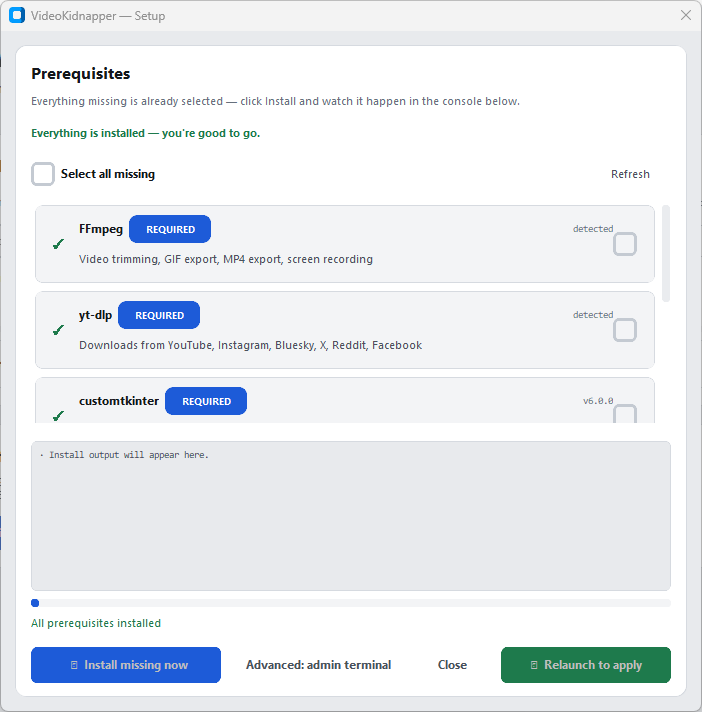

Opened from **Setup and components…** in the settings (gear) menu. When FFmpeg is missing on first run, a setup screen explains the source, destination, and integrity check before asking permission to install. Each row describes a prerequisite and the feature it unlocks; required items are pre-checked, optional ones wait for opt-in. **Select all missing** toggles every installable row.

- **Install Selected** runs in a background thread: FFmpeg is pulled as a portable build (gyan.dev on Windows, checked against the publisher's SHA-256 digest; on macOS the same static build the Mac app bundles, checked against digests pinned in the source), staged, and then placed in `assets/ffmpeg/bin/` (the app's fallback lookup path). Python packages use `python -m pip install --user`; no admin access is needed.
- **Open Admin Terminal** launches an elevated shell pre-populated with the right commands for your OS: `winget install Gyan.FFmpeg` on Windows (via PowerShell `Start-Process -Verb RunAs`), `brew install ffmpeg` on macOS (via Terminal + `osascript`), `sudo apt-get install ffmpeg` on Linux. If no terminal is available, commands are copied to the clipboard as a fallback.
- **Relaunch** restarts the current process so newly-installed prerequisites are picked up.

### Share (inside the Export dialog)

After a successful export, the Export dialog reveals a share panel with a caption entry and one button per supported platform. Clicking a button:

1. Copies the exported file to the OS clipboard (Windows: PowerShell `Set-Clipboard -Path`; macOS: `pbcopy`; Linux: `xclip`)
2. Opens the platform's compose / upload page in your browser (pre-filled with your caption on X, Reddit, and Facebook's sharer)
3. Shows a one-line instruction ("Click + Create, then paste the file", etc.)

---

## Text layers

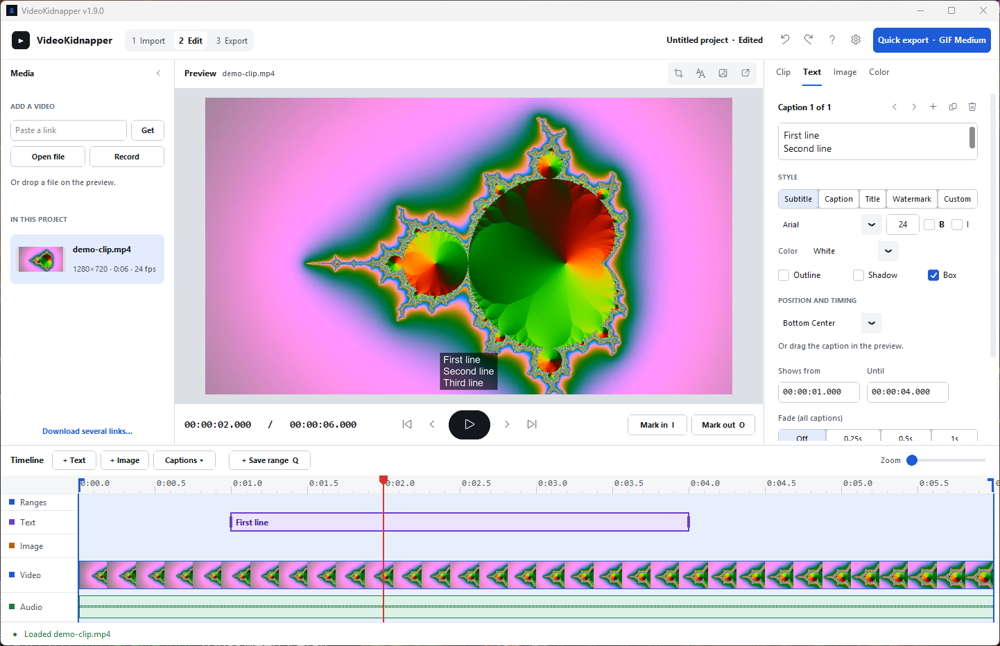

Each caption is a clip on the timeline's Text track. Select one on the timeline (or with the arrows in the Inspector) and the **Text** tab edits it:

- **Style presets** — Subtitle (white-on-black box), Caption (white with black outline, the social-standard look), Title (large centered), Watermark (small corner), Custom
- Font (system fonts), size, color (8 presets + **Custom…** color picker), position (7 anchors, or drag it in the preview)
- **Bold / italic** toggles, resolved to real font-variant files (`arialbd.ttf`, `ariali.ttf`, ...) with graceful fallback when a variant is missing
- **Outline**, **Shadow** and **Box** toggles, compiled to drawtext `borderw` / `shadowx` / `box` and mirrored exactly in the preview
- **Multiline captions:** the text box wraps, and embedded newlines export as real line breaks
- Timing — type exact times, or drag the clip and its edges on the timeline
- **Record a motion path** — keyframe a caption's position so it follows a moving subject; drag to set the path or **Follow an object from here** with OpenCV, then compiled to a drawtext time expression that preview and export share
- Add, duplicate, and delete from the Inspector header
- **Fade** (0.25s / 0.5s / 1s, for all captions) — symmetric fade-in/fade-out via a drawtext `alpha=` expression
- Live PIL-rendered overlay on the preview canvas — font size, position, and box padding all match ffmpeg's export output

---

## Quality presets

| Preset | FPS | Max Width | GIF Colors | Video CRF |
|---|---|---|---|---|
| Low    | 10 | 480px  | 64  | 28 |
| Medium | 15 | 720px  | 128 | 23 |
| High   | 24 | 1080px | 256 | 18 |
| Ultra  | 30 | Native | 256 | 15 |

When a hardware encoder is available, CRF maps to the right flag per encoder (`-cq` for NVENC, `-global_quality` for QSV, `-q:v` for VideoToolbox).

---

## Keyboard shortcuts

| Key | Action |
|---|---|
| **Space** / **K** | Play / Pause |
| **J** | Move the playhead back 1s |
| **L** | Move the playhead forward 1s |
| **I** | Set the in point at the playhead |
| **O** | Set the out point at the playhead |
| **Q** | Save the selection as a range |
| **Ctrl+Z** | Undo (captions, overlays, crop, selection, saved ranges) |
| **Ctrl+Y** / **Ctrl+Shift+Z** | Redo |
| **Ctrl+E** | Export with the current settings |
| **Ctrl+O** | Open video file |
| **Ctrl+V** | Paste — a video/GIF link opens Import from anywhere; a clipboard image becomes an overlay in Edit |

Entry fields swallow shortcuts so typing into them doesn't scrub the video.

---

## Installation

### Option A — Windows (no Python required)

Get it from the **[Microsoft Store](https://apps.microsoft.com/detail/9N4BMTK8Q7KG)** (signed, auto-updates, no security warning), or download **`VideoKidnapper.exe`** / the Setup installer from the [latest release](https://github.com/AES256Afro/VideoKidnapper/releases/latest). If a prerequisite is missing, first-run setup explains the verified download and asks before installing it.

### Option B — macOS (no Python required)

Download the `.dmg` for your Mac from the [latest release](https://github.com/AES256Afro/VideoKidnapper/releases/latest) — `…-macos-arm64.dmg` (Apple Silicon) or `…-macos-x86_64.dmg` (Intel) — and drag the app to Applications. FFmpeg is bundled.

> **Signed and notarized by Apple** as of v1.8.2, so it opens with a normal double-click — no security prompt, no Settings trip.
>
> If macOS says *"Apple could not verify VideoKidnapper is free of malware"*, you have **v1.8.1**: press **Done**, then **System Settings → Privacy & Security → Open Anyway**, or just upgrade. If it says *"VideoKidnapper is damaged and can't be opened"*, you have **v1.8.0**, whose DMGs shipped with a broken code signature that no workaround can clear — upgrade.

### Option C — Linux AppImage (no Python required)

Download **`VideoKidnapper-x86_64.AppImage`** from the [latest release](https://github.com/AES256Afro/VideoKidnapper/releases/latest):

```bash
chmod +x VideoKidnapper-x86_64.AppImage
./VideoKidnapper-x86_64.AppImage
```

FFmpeg is bundled — nothing else to install. Works on any glibc 2.35+ distro: Ubuntu 22.04+, Debian 12+, Fedora 36+, and immutable distros like **Bazzite**, SteamOS 3+, and Silverblue (where the AppImage is the recommended route since you can't layer packages). For an app-menu entry + icon, add it with [Gear Lever](https://flathub.org/apps/it.mijorus.gearlever).

On **Ubuntu / Debian / Mint** you can instead use the APT repository — one-time setup, then updates arrive through normal `apt upgrade`:

```bash
sudo install -d /etc/apt/keyrings
curl -fsSL https://aes256afro.github.io/apt/videokidnapper.asc | sudo tee /etc/apt/keyrings/videokidnapper.asc > /dev/null
echo "deb [signed-by=/etc/apt/keyrings/videokidnapper.asc] https://aes256afro.github.io/apt stable main" | sudo tee /etc/apt/sources.list.d/videokidnapper.list
sudo apt update && sudo apt install videokidnapper
```

(Or grab the `.deb` from the release page and `sudo apt install ./videokidnapper_*.deb` — same package, no repo setup, no auto-updates.)

PyPI also works if you prefer pip:

```bash
sudo apt install python3-pip python3-tk ffmpeg xclip
pip install "videokidnapper[all]"
videokidnapper
```

### Option D — PyPI (recommended if you have Python)

```bash
pip install videokidnapper            # core install
pip install "videokidnapper[dnd]"     # + drag-and-drop support
videokidnapper                        # launches the GUI
videokidnapper --help                 # CLI mode
```

You still need FFmpeg on `PATH`, or use **Setup and components…** in the app's settings menu to install a verified portable copy (Windows and macOS). On Linux use your package manager.

### Option E — Clone and install (contributors / latest `main`)

### 1. Install Python 3.9 – 3.14

### 2. Clone and install

```bash
git clone https://github.com/AES256Afro/VideoKidnapper.git
cd VideoKidnapper
pip install -e .                      # editable install — picks up your edits
# or the old way:
pip install -r requirements.txt
```

### 3. FFmpeg

Three options — the Setup dialog handles all of them:

- **Auto-install (Windows and macOS)**: open **Setup and components…** from the settings menu → check FFmpeg → **Install Selected**. Pulls a verified build into `assets/ffmpeg/bin/`: gyan.dev essentials on Windows, the static build the Mac app bundles on macOS.
- **Manual portable**: drop `ffmpeg.exe` and `ffprobe.exe` into `assets/ffmpeg/bin/` yourself.
- **System install**: `winget install Gyan.FFmpeg` (Windows) / `brew install ffmpeg` (macOS) / `sudo apt install ffmpeg` (Linux).

### 4. Run

```bash
python main.py           # GUI (works from a clone without installing)
python main.py --help    # CLI help
# or, after `pip install -e .`:
videokidnapper           # GUI
videokidnapper --help    # CLI help
```

---

## CLI mode

```bash
python main.py --url "https://youtu.be/..." --start 10 --end 25 \
               --format GIF --quality High --speed 1.5 --aspect 9:16
```

All flags: `--url`, `--file`, `--start`, `--end`, `--out`, `--format {MP4,GIF}`, `--quality {Low,Medium,High,Ultra}`, `--speed`, `--rotate {0,90,180,270}`, `--mute`, `--audio-only`, `--aspect {Source,1:1,9:16,16:9,4:5,3:4}`, `--hw {auto,off}`.

Passing any flag (or `--help`) skips the GUI and runs headless.

---

## Export naming

Exports are named after the video: the title a download reported, or the file name of a local video. **Export ▸ File names** picks the style and shows what the next file will be called:

| Style | Example |
|---|---|
| Video title (default) | `Cat Video Take 2.mp4` |
| Video title + date | `Cat Video Take 2_20261006.mp4` |
| Video title + date & time | `Cat Video Take 2_20261006_143022.mp4` |
| VidKid + timestamp | `VidKid_trim_20261006_143022.mp4` |

Titles are cleaned up for the file system (path separators, Windows-illegal characters and device names like `CON` are removed; accents, CJK and emoji are kept), and a second export of the same clip gets `_1`, `_2` rather than overwriting. Files go to the folder set in **Export ▸ Save to**.

When "Join everything into one video" is on, the intermediate per-range files are cleaned up and only the joined file is kept.

---

## Tech stack

- **CustomTkinter** — GUI framework (five themes: Studio, Graphite, Cream retro tech, Fallout, Retro)
- **Pillow** — frame preview + live text-layer overlay
- **yt-dlp** — multi-platform video downloading
- **FFmpeg** — video/GIF encoding with drawtext overlays
- **mss** — cross-platform screen capture
- **tkinterdnd2** *(optional)* — drag-and-drop on the preview canvas

---

## Tests

```bash
pip install pytest
python -m pytest tests/ -v
```

500+ tests covering URL detection, project files and recovery paths, install-aware updates, verified prerequisite staging, platform share intents, ffmpeg filter construction, text styling, download retry classification and cookie resolution, settings migration, SRT parsing, size estimation, cache behavior, and drag-and-drop payload parsing.

---

---

## Disclaimer & terms of use

VideoKidnapper is a personal utility for trimming and re-encoding video you have the right to use. By running this software you acknowledge:

- **Platform terms of service.** Downloading from services like YouTube, Instagram, Twitter/X, Reddit, Bluesky, and Facebook may violate their terms of service. You are responsible for ensuring your use complies with each platform's current ToS, your local laws, and applicable copyright law (DMCA, Fair Use, and equivalents in your jurisdiction).
- **Copyright.** Re-hosting, re-sharing, or monetizing content you don't own or have a license to use is your responsibility and not this project's.
- **Cookies.** The "Cookies from browser" option reads authentication cookies from your installed browsers through `yt-dlp`. Never share a cookie file or export — it grants session-level access to your accounts.
- **No warranty.** The software is provided "as is" without warranty of any kind; see the LICENSE file for the full terms.

The project's authors and contributors do not endorse or encourage violation of any platform's terms of service or any applicable law.

---

## License

Licensed under the **Apache License, Version 2.0** — see [LICENSE](LICENSE) for the full text.

> **Note on historic releases.** The `v1.0.0` tag and earlier were published under the GNU General Public License v3.0 and remain available under GPLv3. Apache-2.0 applies to `v1.1.0` and every later commit on `main`.

VideoKidnapper depends on several third-party projects with their own licenses:

| Project | License |
|---|---|
| [CustomTkinter](https://github.com/TomSchimansky/CustomTkinter) | MIT |
| [Pillow](https://github.com/python-pillow/Pillow) | MIT-CMU / HPND |
| [yt-dlp](https://github.com/yt-dlp/yt-dlp) | Unlicense |
| [mss](https://github.com/BoboTiG/python-mss) | MIT |
| [tkinterdnd2](https://github.com/pmgagne/tkinterdnd2) | BSD-3-Clause (optional) |
| [FFmpeg](https://ffmpeg.org/) | LGPLv2.1+ / GPLv2+ (build-dependent; `essentials` builds are GPL) |

If you bundle FFmpeg with a redistribution of VideoKidnapper, note that the `essentials` and `full` gyan.dev builds ship under GPL — complying with GPL requires offering source on request. Alternatively, use an `LGPL` FFmpeg build for LGPL-only redistribution.
